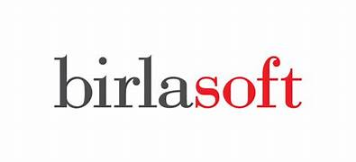

# Varshith Rao - Java Full Stack Developer

**Email:** Varshith Rao  
**Phone:** 513-428-6763  
**Location:** Dayton, OH  

---

## Professional Summary

- 7+ years of experience in web application development, including analysis, design, and maintenance, with proficiency in both Agile and Waterfall methodologies.
- Expert in Java and Spring Boot, specializing in microservices architecture, RESTful API development, and security implementations using OAuth2.0 and Spring Security.
- Advanced skills in front-end technologies, including Angular, ReactJS, and modern JavaScript frameworks, with a focus on developing dynamic, responsive user interfaces.
- Proficient in backend technologies, utilizing Spring Framework (Spring Boot, Spring MVC, Spring Data), Hibernate, and Java EE for scalable and robust enterprise applications.
- Strong database management expertise, with experience in relational databases (MySQL, Oracle, PostgreSQL) and NoSQL databases (MongoDB), including designing complex schemas and optimizing queries.
- Experienced in cloud technologies and DevOps practices, including deploying applications on AWS (EC2, S3, Lambda) and optimizing cloud infrastructure, as well as implementing CI/CD pipelines with Jenkins, GitLab CI/CD, Docker, and Kubernetes.

---

## Technical Skills

**Methodologies:** SDLC, Agile, Waterfall, Scrum, TDD  
**Programming Languages:** C, C++, Java, JavaScript, Python, SQL  
**Frontend Technologies:** HTML5, CSS3, Bootstrap, JSP, AngularJS, NodeJS, ReactJS, Redux  
**Backend Technologies:** Spring Framework (Spring Boot, Spring MVC, Spring Data, Spring Security), Hibernate, J2EE, RESTful APIs, JMS, JDBC, Microservices Architecture  
**Messaging and Streaming:** Active MQ, JMS, SQS, Apache Kafka  
**Database Technologies:** MySQL, Postgres, Oracle, DB2, MongoDB  
**Cloud Technologies:** AWS, Azure, GCP  
**Containerization and Orchestration, CI/CD:** Docker, Kubernetes, Helm, Jenkins, GitLab  
**Version Control Tools:** Git, GitHub, SVN, BitBucket/Stash  
**API Documentation and Testing Tools:** JUnit, Mockito, Selenium, Postman, JMeter  
**Code Quality and Monitoring:** SonarQube, ELK Stack, Prometheus, Grafana, Log4J  
**Security and Authentication:** OAuth2.0, JWT  
**Development Tools and IDEs:** IntelliJ IDEA, Eclipse, Visual Studio Code, Spring Tool Suite, PyCharm, Anaconda  
**Design Patterns and Architectural Styles:** MVC, Microservices, Serverless Architecture  
**Web Services:** RESTful APIs, SOAP, API Gateway, Swagger, GraphQL  
**Other:** XML, JSON, Design Patterns, Linux/Unix  

---

## Professional Experience

### Full Stack Developer at Birlasoft  
**April 2023 - Present**  

**Responsibilities:**
- Designed microservices architecture using Spring Boot and Spring Cloud for financial operations.
- Built dynamic user interfaces with React.js for real-time data visualization.
- Integrated Kafka for efficient asynchronous messaging.
- Deployed cloud infrastructure using AWS services such as EC2, S3, RDS, and Lambda.

---

### Full Stack Developer at Homegoods  
**September 2021 - March 2023**  

**Responsibilities:**
- Developed RESTful APIs and dynamic front-end interfaces with React.js.
- Built and deployed Dockerized applications integrated with AWS Cloud services.
- Optimized transaction processing by 40% using performance tuning strategies.

---

### Full Stack Developer at Molina Healthcare  
**November 2019 - July 2021**  

**Responsibilities:**
- Created SPAs with React.js and Redux for streamlined user experiences.
- Designed scalable backend systems with Spring Boot and Hibernate.
- Integrated testing frameworks such as JUnit for robust application validation.

---

### Full Stack Developer at Desert Financial  
**September 2018 - October 2019**  

**Responsibilities:**
- Developed web applications using Spring MVC and Hibernate.
- Designed dynamic front-end components with Angular and React.
- Deployed microservices-based applications in cloud environments.

---
### Java Developer at Commercial Bank  
**October 2017 - August 2018**  

**Responsibilities:**
- Developed scalable business components using Spring Boot and Hibernate.
- Created and maintained RESTful APIs to integrate various banking modules.
- Enhanced application performance through database query optimization and caching strategies.
- Designed and developed dynamic web interfaces using AngularJS and Bootstrap.

---

### Java Developer at Accel Frontline Services LTD  
**April 2016 - September 2017**  

**Responsibilities:**
- Designed and implemented web applications using Java, Spring Framework, and Hibernate.
- Developed REST-based microservices to streamline operations across business processes.
- Collaborated with cross-functional teams to gather requirements and deliver user-centric solutions.
- Utilized Docker for containerized deployments and streamlined development workflows.
## Education

**Master of Science, Computer Science** | University of Dayton, Dayton, OH  
**Bachelor of Technology, Computer Science** | Vignana Bharathi Institute of Technology, India  

---

## Contact

Feel free to reach out to me:

- **Email:** varshithrao75@gmail.com  
- **LinkedIn:** [Varshith Rao](https://www.linkedin.com/in/varshith-rao-jdev)  

---

